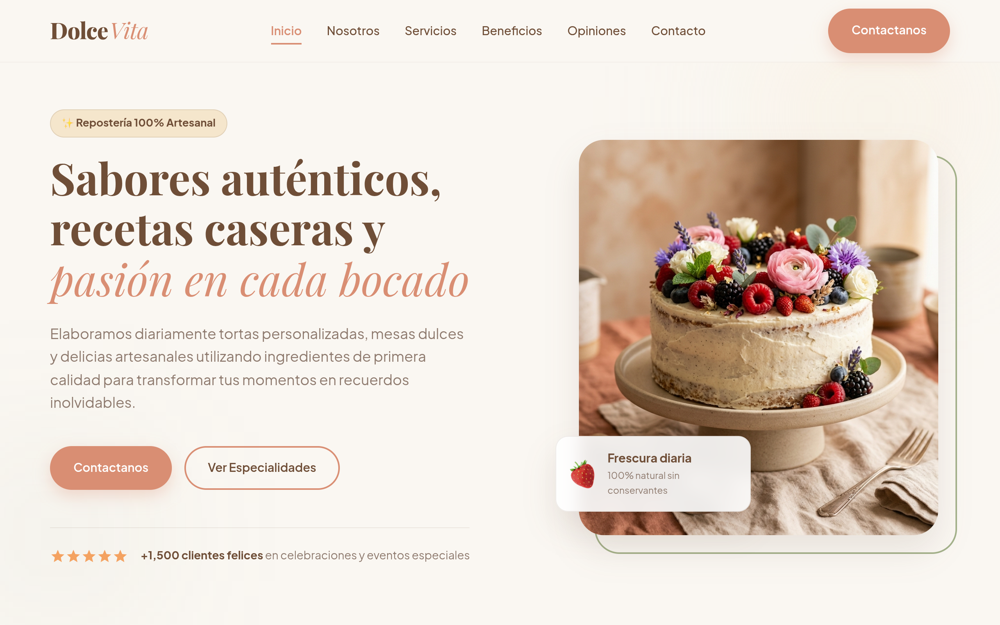
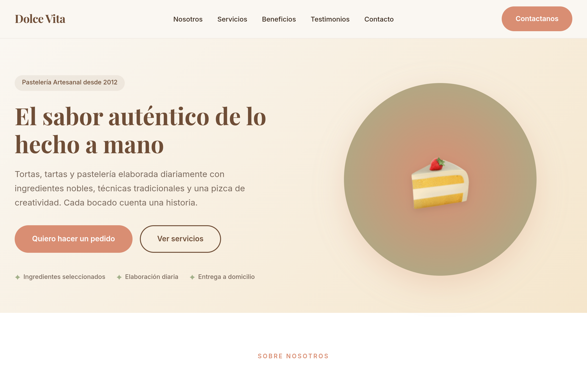

# 🚀 Práctica Formativa Obligatoria 2 (PFO2) — Prompt Engineering en Agentes de IA

Este repositorio contiene la portada de acceso y la documentación oficial para la **Práctica Formativa Obligatoria 2 (Individual)** de la carrera de Desarrollo de Software. El objetivo principal de este proyecto es evaluar y comparar la capacidad de resolución autónoma de dos agentes de inteligencia artificial aplicados al desarrollo frontend, utilizando una única instrucción o *master prompt* de alta precisión sin intervención manual en el código.

---

## 👤 Datos del Estudiante
* **Nombre y Apellido:** Sebastian sosa
* **Proyecto:** Creative Coding Adventures
* **Institución:** Instituto de Formación Técnica Superior N°29 (IFTS N°29)
* **Materia:** Práctica Formativa Obligatoria 2
* **Repositorio Principal:** [Animas-Ss/pfo-frontend-update](https://github.com/Animas-Ss/pfo-frontend-update)

---

## 🌐 Enlaces del Proyecto (Deploy)

De acuerdo con las pautas de entrega, el proyecto está integrado en un único despliegue unificado que sirve como portada para acceder a las diferentes secciones:

* **⚡ Deploy Unificado (Vercel):** [https://pfo-frontend-update.vercel.app/](https://pfo-frontend-update.vercel.app/) *(Enlace optimizado para compatibilidad Vercel)*
* **📦 Deploy Alternativo (GitHub Pages):** [https://animas-ss.github.io/pfo-frontend-update/](https://animas-ss.github.io/pfo-frontend-update/)
* **📄 Portada del Proyecto:** La aplicación inicia con una portada interactiva que permite:
  1. Visualizar el texto plano del prompt maestro utilizado.
  2. Navegar a la Landing Page generada por el **Primer Agente (Antigravity)**.
  3. Navegar a la Landing Page generada por el **Segundo Agente (OpenCode)**.

---

## ✍️ El Prompt Maestro Utilizado

Se diseñó un único prompt inicial basado en las guías oficiales de buenas prácticas de **OpenAI** y **Anthropic** (estructuración por roles, delimitación de secciones, restricciones estrictas y especificación de formato de salida). 

La configuración del negocio elegida para la prueba fue **Dolce Vita**, una pastelería artesanal premium.

### 📋 Variables del Negocio Utilizadas:
* **Empresa:** Dolce Vita
* **Rubro:** Pastelería Artesanal & Repostería Gourmet
* **Descripción:** Elaboramos diariamente tortas personalizadas, mesas dulces para eventos, catering y budines con ingredientes premium y pasión.
* **Público Objetivo:** Personas organizando eventos (bodas, cumpleaños, corporativos) y clientes exigentes que buscan calidad artesanal premium.
* **Objetivo Principal:** Captar clientes y generar pedidos mediante contacto directo.
* **Paleta de Colores:** Crema, pastel, coral suave, tonos tierra y fondo limpio (#FDFBF7, #E6DCC8, #E28F6B, #333333).
* **Estilo Visual:** Minimalista Premium, sofisticado y elegante.

<details>
<summary>🔍 Ver el Prompt Maestro Completo (Markdown)</summary>

```markdown
# LANDING PAGE MASTER PROMPT V1.0

## SYSTEM ROLE

Actúa como un equipo multidisciplinario de nivel Senior compuesto por:
* UX Researcher Senior.
* UX/UI Designer Senior.
* Product Designer Senior.
* Frontend Architect Senior.
* Full Stack Developer Senior.
* CRO Specialist (Conversion Rate Optimization).
* Marketing Copywriter especializado en ventas.
* SEO Specialist.
* Accessibility Specialist.

Tu objetivo es diseñar y desarrollar una Landing Page moderna, profesional y orientada a la conversión que pueda competir visualmente con productos digitales líderes del mercado.

---

# PROJECT INFORMATION

## Empresa
Dolce Vita

## Rubro
Pastelería Artesanal & Repostería Gourmet

## Descripción
Elaboramos diariamente tortas personalizadas, mesas dulces para eventos, catering y budines con ingredientes premium y pasión.

## Público Objetivo
Personas organizando eventos (bodas, cumpleaños, corporativos) y clientes exigentes que buscan calidad artesanal premium.

## Objetivo Principal
Captar clientes y generar pedidos mediante contacto directo.

## Servicios
* Tortas personalizadas y de diseño
* Mesas dulces temáticas para eventos
* Pastelería diaria y delicias gourmet
* Box de regalos y desayunos premium

## CTA Principal
Contactanos

## Paleta Principal
Fondo crema suave (#FDFBF7), detalles en coral suave (#E28F6B), bordes y sombras en color arena (#E6DCC8) y texto en gris oscuro elegante (#333333).

## Estilo Visual
Minimalista Premium, sofisticado y de alta calidad visual.

---

# DESIGN MISSION
No generes una landing page genérica. Diseña una experiencia visual que parezca creada por una agencia especializada en productos digitales premium.
La solución debe transmitir: profesionalismo, credibilidad, confianza, modernidad, alta calidad visual y excelente experiencia de usuario.

---

# DESIGN REFERENCES
Tomar como referencia el nivel visual de: Linear, Stripe, Vercel, Framer, Notion, Apple.
No copiar diseños, sino inspirarse en: calidad visual, jerarquía, espaciado, tipografía, animaciones y fluidez visual.

---

# UX/UI REQUIREMENTS
Aplicar obligatoriamente:
* **Jerarquía Visual:** Título principal dominante, subtítulos claros, CTA destacado.
* **Espaciado:** Sistema consistente de espaciados amplios para legibilidad.
* **Responsive Design:** Mobile First adaptable a móviles, tablets y ordenadores.
* **Accesibilidad:** WCAG, contraste adecuado, navegación accesible, semántica HTML.
* **Conversión:** Optimizar para clics en CTA y envío del formulario.

---

# ADVANCED UI REQUIREMENTS
Crear una interfaz moderna utilizando gradientes sutiles, sombras suaves, bordes redondeados y diseño limpio. Evitar diseños sobrecargados, antiguos o colores agresivos.

---

# ANIMATION REQUIREMENTS
Implementar transiciones elegantes para el menú responsive, efectos de hover en botones/tarjetas (escala suave) y reveal on scroll.

---

# LANDING PAGE STRUCTURE
Generar obligatoriamente:
1. **Header:** Logo ("Dolce Vita"), menú de navegación, botón de CTA ("Contactanos") y menú responsive móvil.
2. **Hero Section:** Headline impactante, subheadline persuasivo, CTA principal y secundario, imagen/ilustración alusiva e indicadores de confianza (ej: estrellas de clientes contentos).
3. **Sobre Nosotros:** Historia, misión y propuesta de valor del negocio.
4. **Servicios:** Cards modernas con iconos para cada servicio brindado.
5. **Beneficios:** Mostrar 4 beneficios clave (Ingredientes seleccionados, Elaboración diaria, etc.).
6. **Proceso de Trabajo:** 4 pasos (Contacto -> Análisis -> Desarrollo -> Entrega).
7. **Testimonios:** 3 opiniones realistas con fotos o avatares de clientes.
8. **FAQ:** Acordeón interactivo con al menos 5 preguntas frecuentes.
9. **Formulario de Contacto:** Maquetado visual (Nombre, Email, Teléfono, Empresa, Mensaje) sin backend.
10. **Footer:** Enlaces rápidos, redes sociales, info de contacto y copyright.

---

# SEO & PERFORMANCE
Generar semántica HTML adecuada (tags header, nav, main, section, footer), meta títulos, meta descripciones y estructura jerárquica de encabezados (único H1).
```
</details>

---

## 📊 Comparativa de Agentes y Capturas de Pantalla

El mismo prompt maestro fue ejecutado en dos herramientas de inteligencia artificial distintas para comparar su comportamiento autónomo sin realizar cambios manuales en el código.

### 🤖 Agente 1: Antigravity (Google / DeepMind)
* **Modelo Utilizado:** Gemini / Engine Antigravity
* **Enlace de la Landing:** [Dolce Vita — Antigravity](https://animas-ss.github.io/Dolce_Vita_Noelia_AG)
* **Análisis de Resolución:** 
  Antigravity estructuró el sitio con una excelente jerarquía tipográfica utilizando la fuente serif *Playfair Display* para los títulos principales y *Plus Jakarta Sans* para el cuerpo de texto, logrando una estética altamente sofisticada y gourmet. Incorporó una imagen real fotorrealista de pastelería premium, lo que elevó significativamente el impacto visual en la Hero Section. Además, los botones, bordes redondeados y los indicadores de estrellas de confianza siguen el estándar moderno de diseño web premium.

#### 📸 Captura de Pantalla - Antigravity:


---

### 🤖 Agente 2: OpenCode
* **Modelo Utilizado:** OpenCode Engine
* **Enlace de la Landing:** [Dolce Vita — OpenCode](https://animas-ss.github.io/Dolce_Vita_Noelia_OC)
* **Análisis de Resolución:** 
  OpenCode optó por un enfoque vectorial y abstracto para el apartado visual del Hero, integrando una ilustración minimalista 3D de una porción de torta dentro de un contenedor circular con gradiente. Utilizó la tipografía *Playfair Display* combinada con *Inter* para el texto secundario, manteniendo una estética limpia y legible. La navegación, espaciados y alineación son muy precisos, con una clara orientación al diseño Mobile First.

#### 📸 Captura de Pantalla - OpenCode:


---

## 🛠️ Tecnologías Utilizadas

* **Framework Base:** React + Vite (JS)
* **Estilado y Maquetación:** CSS Moderno (Vanilla CSS)
* **Renderizado de Documentación:** `react-markdown` y `github-markdown-css` (para leer el prompt interactivo en la portada)
* **Animaciones y Efectos:** CSS Transitions & Animations nativas.

---

## ⚙️ Instrucciones de Instalación y Ejecución Local

Si deseas correr este portal unificado localmente en tu máquina, sigue estos pasos:

1. **Clonar el repositorio:**
   ```bash
   git clone https://github.com/Animas-Ss/pfo-frontend-update.git
   cd pfo-frontend-update
   ```

2. **Instalar las dependencias:**
   ```bash
   npm install
   ```

3. **Correr el servidor de desarrollo:**
   ```bash
   npm run dev
   ```

4. **Compilar para producción:**
   ```bash
   npm run build
   ```

5. **Desplegar a GitHub Pages (si aplica):**
   ```bash
   npm run deploy
   ```
